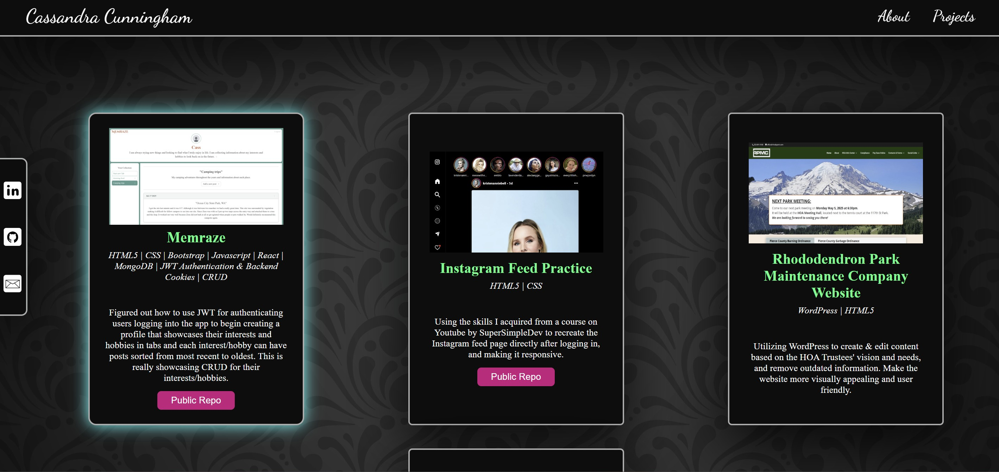

# [Cassandra Cunningham Portfolio](https://scriptsculptorjs.github.io/cassandra-cunningham-portfolio/)
A personal portfolio website built from scratch. It shares information about me and showcases some of the projects I've worked on. This was a fun and rewarding project that highlights both my technical skills and creative approach.

It is responsive to all screen sizes. When the screen is on the smaller size, the 2 nav bars merge into one dropdown menu. Any links to outside sources will open in a new window.

## Table of Contents
* [Motivation](#motivation)
* [Built With](#built-with)
* [How to Use](#how-to-use)
* [Project Status](#project-status)

## Motivation
I wanted to create a site that reflects both my work and personality. Leveraging React.js, JavaScript, CSS, HTML5 and a lot of coffee ☕, I was able to create something I’m truly proud of.

This wasn’t just a technical challenge — it was a creative journey that allowed me to deepen my frontend skills, experiment with UI/UX principles, and have fun bringing my ideas to life.

## Built With
React.js (Vite), JavaScript, CSS, HTML5

## How to Use
When visiting the site, you will see 2 nav bars: 1) containing social links and 2) links to the About and Projects pages. 

The social links are located on the left of the screen. You will see a link for my LinkedIn profile, my Github profile, and the ability to email me.

You can click About to be brought to my About page where you will find information on my, my skills, and eagerness to work with a team.

You can click on Projects to be brought to my Projects page where you will find completed projects I had created myself, and a Wordpress website I updated for Rhododendron Park Maintenance Company's HOA Board.

There are 2-3 links for each project. The image and project title can be clicked to see the live project. For those that have a Github repository, you will find a button that will take you to the public repo.

When you are ready to go back to the Home page, you can click my name "Cassandra Cunningham" in the top left corner of the screen. 

## Project Status
Continually updating as I continue to grow as a software engineer.
